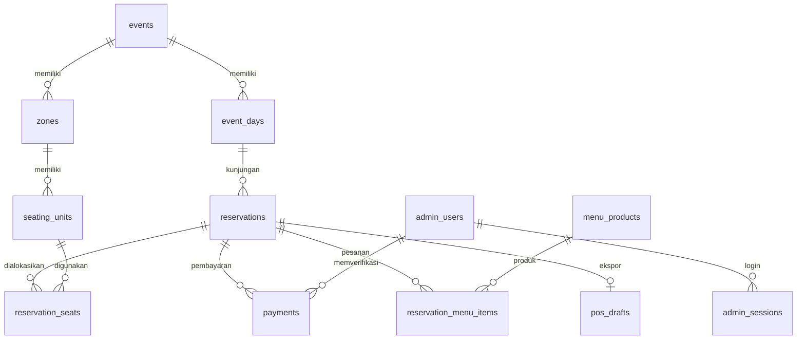

# Sumber dan struktur data

Versi awal tidak menggunakan database: angka kursi dan menu adalah array contoh di `dist/app.js`. Revisi ini menghapus array tersebut. Browser membaca API; API menghitung angka dari database relasional.

## Lokasi penyimpanan

| Lingkungan | Sumber data | Sifat |
| --- | --- | --- |
| Lokal (`npm run dev`) | SQLite `.data/teaco.sqlite` | Persisten pada komputer ini, tidak tersinkron antarperangkat |
| Vercel | Turso Cloud dari `TURSO_DATABASE_URL` + `TURSO_AUTH_TOKEN` | SQLite online, persisten dan dipakai bersama semua perangkat |
| API kasir | `POS_MENU_URL` | Sumber produk/menu; salin ID produk asli ke `menu_products` |

Tanpa kredensial Turso lengkap pada production, API menolak pembuatan reservasi. URL `file:` juga ditolak pada production. Tidak ada fallback ke database sementara atau localStorage. Penyimpanan browser hanya dipakai untuk preferensi tema dan token akses reservasi aktif, bukan sebagai sumber booking. Konfigurasi PostgreSQL lama `DATABASE_URL` tidak lagi digunakan.

## Relasi utama

Foreign key, status yang dibatasi, kapasitas/jumlah positif dan indeks tanggal/status berada di `server/schema.sql`. `settings` menyimpan rekening; `audit_log` mencatat perubahan oleh admin; `login_attempts` membatasi percobaan login.

## Hitungan kuota

- Batas **tamu**: 65 per tanggal, bukan jumlah kursi fisik denah.
- `HOLD`, `PENDING_PAYMENT`, `PENDING_VERIFICATION`, `CONFIRMED`, `MENU_SELECTED`, `CHECKED_IN`, `DONE` mengonsumsi kuota pada tanggalnya.
- `EXPIRED` dan `CANCELLED` tidak mengonsumsi kuota.
- Angka **booked** hanya status DP terkonfirmasi dan setelahnya.
- Meja/section dipakai eksklusif oleh satu reservasi aktif. Tamu dapat memilih beberapa unit; jumlah alokasi harus cukup. Kursi kosong pada meja yang dipesan tidak ditawarkan ke reservasi lain.
- Kalender menawarkan nilai minimum antara sisa kuota dan kapasitas unit yang belum dikunci, dikurangi tamu hold yang belum mendapatkan alokasi. Meja terkunci tidak dihitung sebagai kursi yang masih dapat dipesan.
- Unit normal tersedia 84 kursi: Indoor 24, AC 16, Outdoor 44. Batas fisik 88 dari dokumen membutuhkan override AC 20 tamu, yang belum diaktifkan.

Pembuatan hold dan pemilihan tempat memakai transaksi. Turso memakai transaksi `write` (`BEGIN IMMEDIATE`), sehingga pemeriksaan kuota dan penyimpanan reservasi berada di bawah kunci penulisan database yang sama, termasuk antar-instance Vercel. Konflik `SQLITE_BUSY` dicoba ulang secara terbatas setelah rollback; error jaringan/commit tidak dicoba ulang secara membabi buta. SQLite lokal menggunakan `BEGIN IMMEDIATE` dan antrean pembacaan/penulisan. Hold berakhir setelah 15 menit; expiry diselesaikan saat API dibaca/diubah. Schema dan seed Turso dibuat dalam satu batch atomik dengan `IF NOT EXISTS`/`ON CONFLICT DO NOTHING`, tanpa menghapus data yang sudah ada.

## Admin dan bukti pembayaran

Password memakai scrypt dengan salt acak, tidak dikirim ke frontend. Token sesi disimpan sebagai hash di database dan dikirim lewat cookie HttpOnly, SameSite Strict, Secure pada production; masa aktif 8 jam. Login admin bukan sekadar flag pada JavaScript.

Data bukti DP kecil disimpan di tabel `payments` sebagai base64, hanya tersedia melalui endpoint admin yang mengautentikasi setiap permintaan. Respons kalender dan dashboard tidak mengirim isi file. Turso, token akses, dan backup-nya harus tetap privat. Jika volume unggahan meningkat, pindahkan isi file ke private object storage dan simpan referensinya di tabel ini.

## Production belum diprovisikan

Kode backend dan schema Turso tersedia, tetapi database online belum dibuat/dihubungkan melalui akun pengguna. Men-deploy source tidak otomatis menciptakan database Turso. Menu dan draft tidak akan diklaim berasal/masuk kasir sampai adaptor serta kredensialnya terhubung. File SQLite lokal tidak otomatis diunggah ke Turso; data lokal tetap dipertahankan. Jika ada reservasi lokal nyata, migrasi perlu dilakukan terpisah setelah konfirmasi dan backup.

## Aktivasi melalui Vercel Marketplace

1. Install [Turso Cloud](https://vercel.com/marketplace/tursocloud), pilih paket yang sesuai, dan buat database `teaco-reservation`.
2. Connect database ke project Vercel yang melayani domain `teaco-reservation.vercel.app`, untuk environment Production. Integrasi menyediakan `TURSO_DATABASE_URL` dan `TURSO_AUTH_TOKEN`; pastikan tidak memakai prefix lain.
3. Tambahkan `ADMIN_USERNAME` (3–40 karakter) dan `ADMIN_PASSWORD` (minimal 10 karakter, unik) sebagai variabel server Production. Tidak ada password bawaan. Keduanya hanya membuat admin pertama jika database belum memiliki admin, bukan mereset password admin yang sudah ada.
4. Deploy commit terbaru dari `main` ke Production. Schema/seed dibuat saat permintaan API pertama; angka kuota tidak dibuat-buat jika koneksi gagal.
5. Pastikan `/api/public` mengembalikan `ready: true`. Login admin, lalu atur rekening DP. Endpoint menu dan draft kasir dapat dihubungkan setelah kontrak API kasir tersedia.
6. Jangan menaruh kredensial di GitHub, frontend, screenshot, atau chat.

## Pengujian tanpa kredensial online

`npm test` memeriksa SQLite lokal, validasi production tanpa kredensial, dan adapter libSQL pada file uji terpisah. Untuk menjalankan seluruh alur API dengan driver libSQL (bukan `node:sqlite`), set `TEACO_TEST_TURSO=1` saat menjalankan `node --test test/api.test.js`. Database uji dibuat pada direktori temporary terpisah, bukan `.data/teaco.sqlite`. Pengujian ini tidak mengklaim koneksi Turso production sudah aktif.
