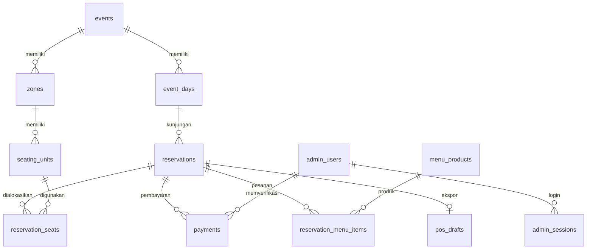

# Sumber dan struktur data

Versi awal tidak menggunakan database: angka kursi dan menu adalah array contoh di `dist/app.js`. Revisi ini menghapus array tersebut. Browser membaca API; API menghitung angka dari database relasional.

## Lokasi penyimpanan

| Lingkungan | Sumber data | Sifat |
| --- | --- | --- |
| Lokal (`npm run dev`) | SQLite `.data/teaco.sqlite` | Persisten pada komputer ini, tidak tersinkron antarperangkat |
| Vercel | PostgreSQL dari `DATABASE_URL` | Persisten dan dipakai bersama semua perangkat |
| API kasir | `POS_MENU_URL` | Sumber produk/menu; salin ID produk asli ke `menu_products` |

Tanpa `DATABASE_URL` pada production, API menolak pembuatan reservasi. Tidak ada fallback ke database sementara atau localStorage. Penyimpanan browser hanya dipakai untuk preferensi tema dan token akses reservasi aktif, bukan sebagai sumber booking.

## Relasi utama

Foreign key, status yang dibatasi, kapasitas/jumlah positif dan indeks tanggal/status berada di `server/schema.sql`. `settings` menyimpan rekening; `audit_log` mencatat perubahan oleh admin; `login_attempts` membatasi percobaan login.

## Hitungan kuota

- Batas **tamu**: 65 per tanggal, bukan jumlah kursi fisik denah.
- `HOLD`, `PENDING_PAYMENT`, `PENDING_VERIFICATION`, `CONFIRMED`, `MENU_SELECTED`, `CHECKED_IN`, `DONE` mengonsumsi kuota pada tanggalnya.
- `EXPIRED` dan `CANCELLED` tidak mengonsumsi kuota.
- Angka **booked** hanya status DP terkonfirmasi dan setelahnya.
- Meja/section dipakai eksklusif oleh satu reservasi aktif. Tamu dapat memilih beberapa unit; jumlah alokasi harus cukup. Kursi kosong pada meja yang dipesan tidak ditawarkan ke reservasi lain.
- Kalender menawarkan nilai minimum antara sisa kuota dan kapasitas unit yang belum dikunci, dikurangi tamu hold yang belum mendapatkan alokasi. Meja terkunci tidak dihitung sebagai kursi yang masih dapat dipesan.
- Unit normal tersedia 84 kursi: Indoor 24, AC 16, Outdoor 44. Batas fisik 88 dari dokumen membutuhkan override AC 20 tamu, yang belum diaktifkan.

Pembuatan hold dan pemilihan tempat memakai transaksi. PostgreSQL mengunci baris `event_days` sehingga permintaan bersamaan untuk tanggal yang sama tidak melewati kuota. SQLite lokal menggunakan `BEGIN IMMEDIATE` dan antrean pembacaan/penulisan. Hold berakhir setelah 15 menit; expiry diselesaikan saat API dibaca/diubah.

## Admin dan bukti pembayaran

Password memakai scrypt dengan salt acak, tidak dikirim ke frontend. Token sesi disimpan sebagai hash di database dan dikirim lewat cookie HttpOnly, SameSite Strict, Secure pada production; masa aktif 8 jam. Login admin bukan sekadar flag pada JavaScript.

Data bukti DP kecil disimpan di tabel `payments` sebagai base64, hanya tersedia melalui endpoint admin yang mengautentikasi setiap permintaan. Respons kalender dan dashboard tidak mengirim isi file. PostgreSQL dan backup-nya harus tetap privat. Jika volume unggahan meningkat, pindahkan isi file ke private object storage dan simpan referensinya di tabel ini.

## Production belum diprovisikan

Kode backend dan schema tersedia, tetapi connection string database production belum diberikan/dipasang. Men-deploy source tidak otomatis menciptakan PostgreSQL. Menu dan draft tidak akan diklaim berasal/masuk kasir sampai adaptor serta kredensialnya terhubung.
